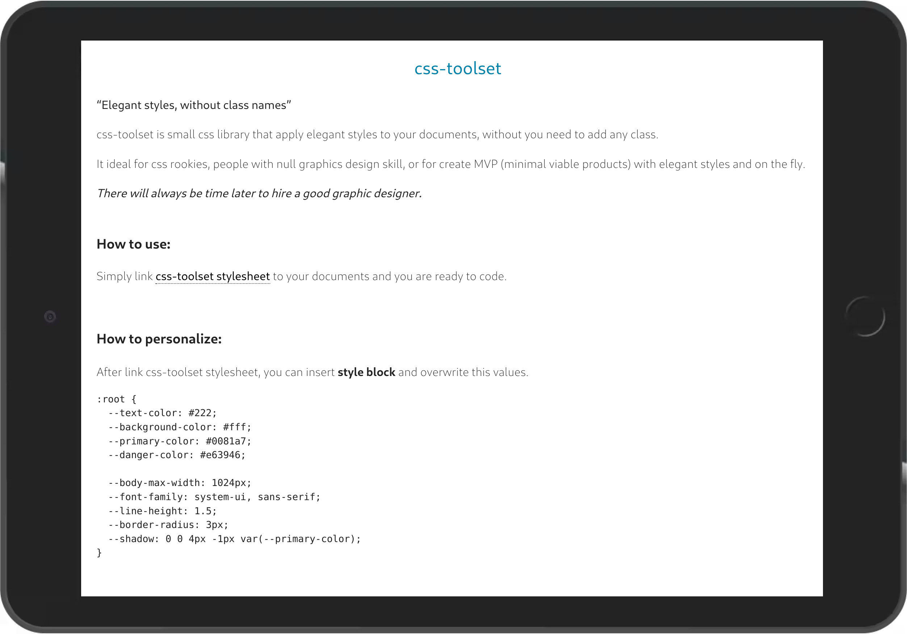

# css-toolset

> "Elegant styles, without class names"

css-toolset is small css library that apply elegant styles to your documents, without you need to add any class.

It ideal for css rookies, people with null graphics design skill, or for create MVP (minimal viable products) with elegant styles and on the fly.
There will always be time later to hire a good graphic designer.

[Live demo]()



## How to use:

Simply link **css-toolset** stylesheet to your documents and you are ready to code.

## How to personalize:

After link css-toolset stylesheet, you can insert style block and overwrite this values.

```css
:root {
  --text-color: #222;
  --background-color: #fff;
  --primary-color: #0081a7;
  --danger-color: #e63946;

  --body-max-width: 1024px;
  --font-family: system-ui, sans-serif;
  --line-height: 1.5;
  --border-radius: 3px;
  --shadow: 0 0 4px -1px var(--primary-color);
}
```
